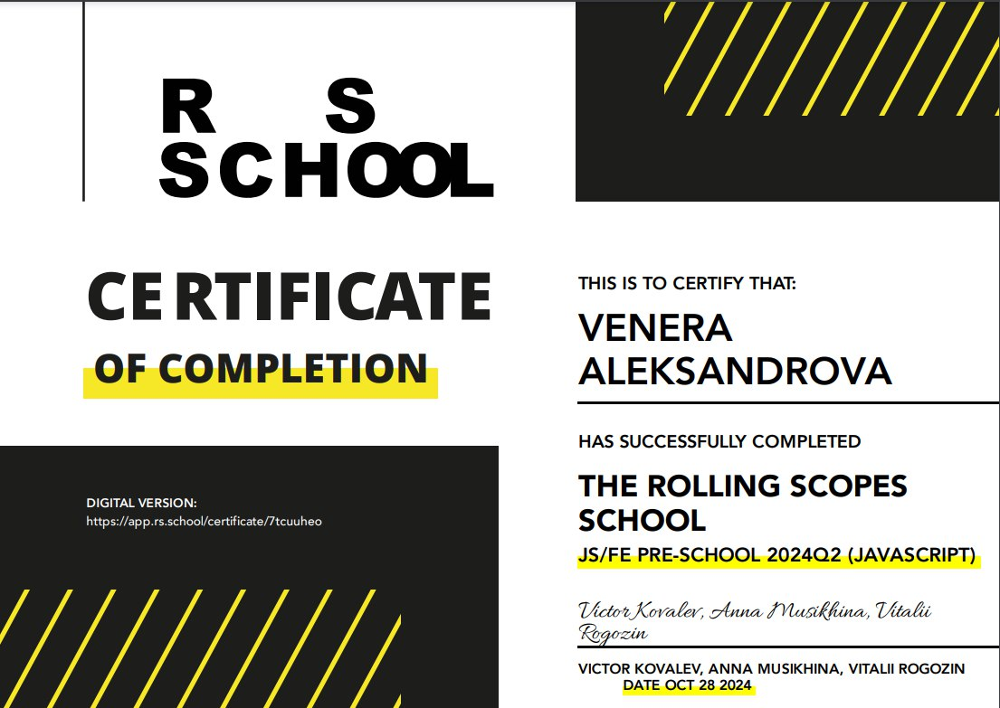

# Aleksandrova Venera

## Junior Frontend Developer

### Contact information:

**E-mail:** v.faizyeva@gmail.com  
**Discord:** @venera3239

### Skills and Proficiency:

- HTML, CSS
- JavaScript Basics
- Git, GitHub
- VS Code

### Work Experience

- [Image-Gallery](https://veneraaleksandrova.github.io/gallery/gallery/index.html)
- [Game](https://veneraaleksandrova.github.io/random-game/random-game/)
- [Audio-Player](https://veneraaleksandrova.github.io/audio/audio-player/index.html)

### Code Example:

    function playSong() {
        if (!isPlaying) {
            audio.play();
            isPlaying = true;
            controlIcon.classList.remove("fa-play");
            controlIcon.classList.add("fa-pause");
        } else {
            audio.pause();
            isPlaying = false;
            controlIcon.classList.remove("fa-pause");
            controlIcon.classList.add("fa-play");
        }
    }

### Education:

**_JS/FE Pre-School:_**

